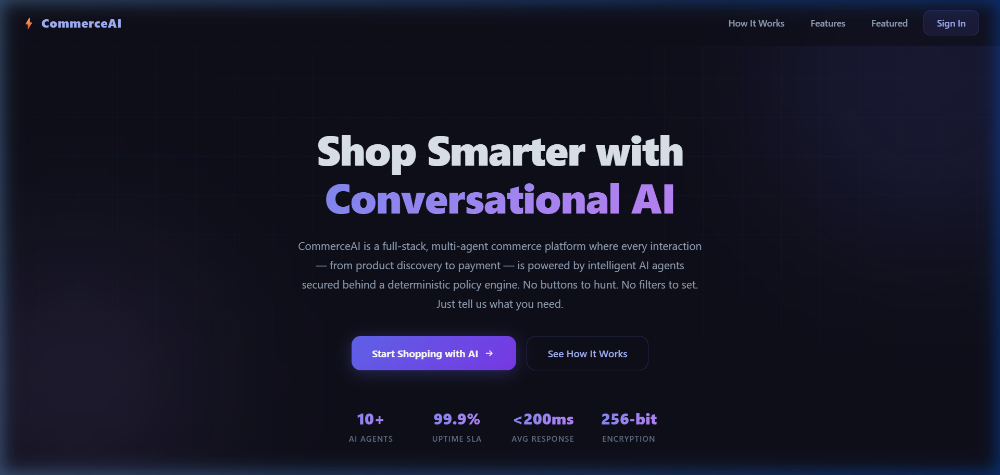

# ⚡ CommerceAI

An AI-native commerce platform designed to demonstrate modern multi-agent architectures, interactive conversational shopping, comprehensive observability, and robust security policy enforcement in LLM-driven applications.



---

## 🌟 Key Features

- 💬 **Conversational AI Shopping**: Perform product search, comparison, and cart actions using natural language queries.
- 🤖 **Multi-Agent Architecture**: Powered by a Commerce Supervisor, Discovery Agent, Growth Agent, and Checkout Agent.
- 🔒 **Deterministic Policy Engine**: Enforces RBAC permissions, resource ownership, and stock constraints before executing tool calls.
- 💳 **Razorpay Integration**: Seamless, PCI-DSS compliant checkout flow with real-time payment status verification.
- ⚡ **Interactive UI Components**: Built with React, Vite, and custom animations like `<LetterGlitch />` from React Bits.

---

## 🏗️ Architecture & Agent Pipeline

CommerceAI uses a multi-agent system built on top of Express, PostgreSQL, Redis, and LangChain:

1. **Commerce Supervisor**: Entry point for user requests. Classifies intent and routes to specialized agents.
2. **Discovery Agent**: Handles product search, comparison, and detail lookups.
3. **Checkout Agent**: Handles cart operations, order creation, and payment initialization.
4. **Policy Engine**: A deterministic security boundary that evaluates every tool execution request against RBAC, ownership, and inventory rules.

---

## 🚀 Setup & Local Execution

### Prerequisites
- Node.js >= 20.0.0
- Docker & Docker Compose (for local PostgreSQL and Redis)
- Gemini API Key

### Running Locally

1. **Start Infrastructure (Database & Redis)**:
   ```bash
   docker-compose up db redis
   ```
2. **Run Database Migrations**:
   ```bash
   npm run build -w packages/database
   node packages/database/dist/migrate.js
   ```
3. **Start the Backend API**:
   ```bash
   npm run dev:api
   ```
4. **Start the Frontend Web App**:
   ```bash
   npm run dev:web
   ```

---

## 🛡️ Security & Observability

- **Complete Audit Logging**: Every LLM interaction is traced from `USER_REQUEST` to `TOOL_COMPLETED` with a unique `agent_run_id`.
- **Policy Enforcement**: The PolicyEngine intercepts all tool executions. If an agent hallucinates a tool call or attempts to modify a resource it doesn't own, the policy engine blocks it.
- **Proactive Prompt Injection Defense**: Validates user inputs before they reach the LLM.

---

## 📝 Testing & Known Notes

- The end-to-end (E2E) AI tests in `apps/api/tests/e2e/commerce.e2e.test.ts` require a valid `GEMINI_API_KEY` to successfully parse complex semantic intents.
- If the Gemini API key is invalid or absent, the system falls back to a rule-based regex classifier.